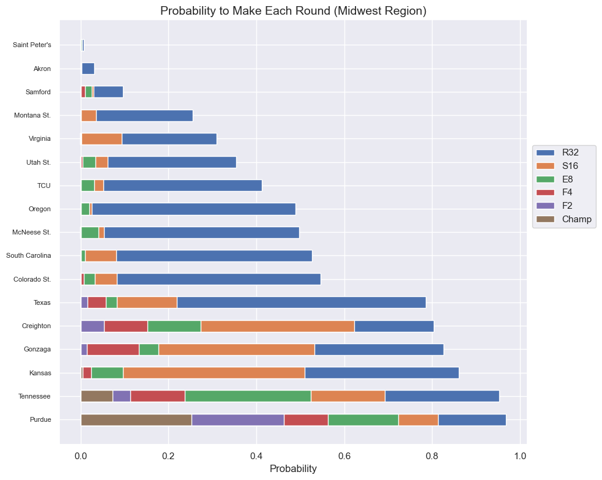

# March Madness Predictions and Probabilities
A data analysis and machine learning project used to analyze success variables in March Madness and create probabilities for reaching each round for each team in the 2024 NCAA Basketball Tournament

Built using Python, pandas, and scikit-learn

## Data
The data used in this analysis is stored in the 'data' directory. Thanks to Bart Torvik and Evan Miyakawa for maintaining some of the best college basketball datasets. 

## Analysis and Model Training 
The main exploratory data analysis and model training is performed in the 'EDA_AND_MODEL_TRAINING.ipynb' Jupyter Notebook. The notebook includes the following steps: 
1. **Data Importation**: Loading .csv files from the 'data' directory after they have been scraped using BeautifulSoup
2. **Data Cleaning**: Removing null values and unwanted variables
3. **Exploratory Data Analysis**: Basic exploration of the data, trying to find key variables for success.
4. **Model Training**: Training and tuning a Random Forest Classifier to predict the losing round of teams in the NCAA Tournament
5. **Evaluation of Model**: Looking at model feature importance and how well it performs on the test set

## Requirements
To run the model training, you need to have the following libraries installed: 

- Python
- pandas
- numpy
- seaborn
- matplotlib
- sklearn

You can install these libraries using 'pip'

## Usage
  1. Clone this repo to your local machine
  2. Navigate to the project directory
  3. Open the 'EDA_AND_MODEL_TRAINING.ipynb' Jupyter Notebook

I hope people can use this project for March Madness tournaments in the future. It should not be too difficult to edit the code to predict for 2025, 2026, etc. tournaments. Also, people could expand on the project to include more variables from other datasets in the model training which should not be too difficult either. 
